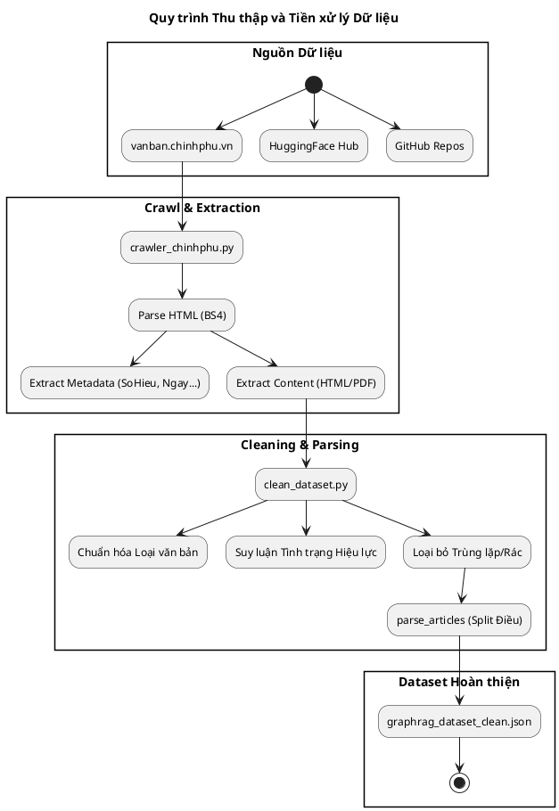
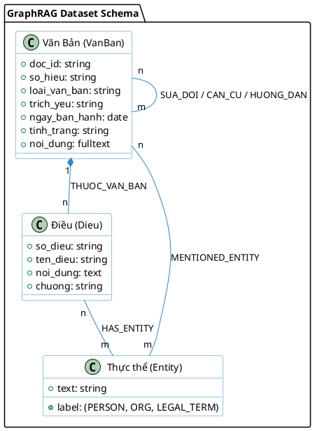

# Báo cáo: Xây dựng và Xác thực Dataset Pháp luật Việt Nam

Báo cáo này tổng hợp quy trình thu thập dữ liệu (crawling), xây dựng dataset bằng LLM và quy trình xác thực (verification) cho hệ thống Hybrid GraphRAG.

---

## 1. Quy trình Crawl dữ liệu (vbpl_crawler)

Dữ liệu được thu thập chủ yếu từ cổng thông tin **vanban.chinhphu.vn** và mở rộng từ các nguồn cộng đồng (HuggingFace, GitHub).

### Sơ đồ quy trình thu thập và tiền xử lý:

### Kỹ thuật Crawling:
- **Nguồn chính**: [vanban.chinhphu.vn](https://vanban.chinhphu.vn/he-thong-van-ban) (Văn bản Quy phạm Pháp luật).
- **Công cụ**: Sử dụng `requests` và `BeautifulSoup4` để parse HTML.
- **Xử lý phân trang**: Hệ thống sử dụng ASP.NET WebForms với cơ chế `__doPostBack`, crawler đã giả lập các trường ẩn như `__VIEWSTATE` để tự động chuyển trang.
- **Xử lý PDF**: Với các văn bản không có nội dung HTML, crawler sử dụng `pdfplumber` để trích xuất văn bản từ file PDF đính kèm.
- **Metadata**: Thu thập đầy đủ các trường: Số hiệu, Loại văn bản, Cơ quan ban hành, Ngày ban hành, Tình trạng hiệu lực, Người ký, Trích yếu và Nội dung toàn văn.

---

## 2. Xây dựng luồng Dataset (Build Dataset Pipeline)

Luồng xây dựng dataset được thiết kế theo mô hình pipeline tự động hóa:

1.  **Phase 1 - Crawling**: Chạy `crawler_chinhphu.py` để thu thập dữ liệu thô (Raw Data) lưu dưới dạng JSON.
2.  **Phase 2 - Cleaning**: Chạy `clean_dataset.py` để chuẩn hóa và lọc dữ liệu thông qua các thuật toán:
    - **Chuẩn hóa loại văn bản**: Sử dụng bảng ánh xạ chuẩn (`LOAI_MAP`) để sửa lỗi chính tả hoặc lỗi OCR (ví dụ: "Sắt luật" -> "Sắc luật", "thông tư" -> "Thông tư"). Chỉ các loại văn bản thuộc danh mục pháp quy chính thức mới được giữ lại.
    - **Suy luận tình trạng hiệu lực**: Với các văn bản thiếu thông tin trạng thái, script quét nội dung (2000 ký tự đầu) để tìm các mẫu ngôn ngữ pháp lý:
        - Mẫu hết hiệu lực: "hết hiệu lực", "bãi bỏ", "được thay thế bởi"... -> Quyết định trạng thái **Hết hiệu lực**.
        - Mẫu còn hiệu lực: "có hiệu lực thi hành", "đang có hiệu lực"... -> Quyết định trạng thái **Còn hiệu lực**.
        - Văn bản trước năm 1975 được tự động phân loại là "Lịch sử".
    - **Loại bỏ trùng lặp (Deduplication)**: Nhóm văn bản theo **Số hiệu**. Nếu phát hiện trùng lặp, hệ thống ưu tiên giữ lại bản ghi có thời gian thu thập mới nhất.
    - **Lọc nội dung không liên quan**: Loại bỏ các văn bản hành chính không mang tính quy phạm pháp luật dựa trên danh sách từ khóa đen (`IRRELEVANT_KEYWORDS`) như "tuyển dụng", "kết quả xổ số", "lịch họp"...
3.  **Phase 3 - Parsing**: Tự động phân tách nội dung văn bản thành các node **Điều (Article)** dựa trên cấu trúc chương/mục/điều.
4.  **Phase 4 - Relation Extraction**: Trích xuất mối quan hệ giữa các văn bản (Căn cứ, Hướng dẫn, Sửa đổi, Bổ sung, Thay thế) từ phần Trích yếu và nội dung văn bản.

---

## 3. Sử dụng LLM để tự xây dựng Dataset

Hệ thống tích hợp LLM (thông qua Ollama/GPT) để làm giàu và cấu trúc hóa dữ liệu:

### Cấu trúc dữ liệu (Schema):

- **Entity Extraction (ViNER)**: Sử dụng module `ViNER` kết hợp Transformer (mô hình `NlpHUST/ner-vietnamese-electra-base`) và Rule-based để trích xuất các thực thể: Người, Tổ chức, Địa điểm, và đặc biệt là các **Thuật ngữ Pháp lý (LEGAL_TERM)**.
- **Graph Indexing (GraphRAG)**: Sử dụng LLM để xây dựng Knowledge Graph phức tạp, tự động tạo các bản tóm tắt cộng đồng (community reports) và liên kết các thực thể tiềm ẩn không có trong text tường minh.
- **Dataset giàu tri thức**: Chuyển đổi từ văn bản phẳng sang đồ thị tri thức (Nodes & Edges) giúp hệ thống RAG có khả năng truy vấn suy luận đa bước.

---

## 4. Quy trình Xác thực Dataset (Verify Dataset)

Sử dụng script `verify_dataset.py` để đánh giá chất lượng dataset cuối cùng theo thang điểm 100:

- **Các chỉ số kiểm tra**:
    - Độ bao phủ nội dung (Missing content check).
    - Độ đầy đủ của Metadata (Số hiệu, Ngày ban hành).
    - Tính hợp lệ của các liên kết (Edge verification).
    - Thống kê phân bổ theo Loại văn bản và Tình trạng hiệu lực.
- **Kết quả xác thực**: Hệ thống tự động gắn nhãn chất lượng (TỐT / CẦN CẢI THIỆN / CẦN KIỂM TRA) dựa trên tỉ lệ thiếu hụt dữ liệu.

---

## 5. Số liệu về Dataset (Dataset Statistics)

Dưới đây là số liệu thực tế sau khi hoàn thành quy trình build dataset:

| Thông số | Giá trị |
| :--- | :--- |
| **Tổng số Văn bản (VanBan)** | **18,096** |
| **Tổng số Điều (Dieu)** | **44,204** |
| **Tổng số Mối quan hệ (Edges)** | **288,900** |
| **Văn bản có nội dung** | 100% |
| **Văn bản có file PDF đi kèm** | 51.8% (9,378 docs) |

### Phân bổ theo loại văn bản (Top 5):
1. **Thông tư**: 10,678
2. **Nghị định**: 4,906
3. **Sắc lệnh**: 913
4. **Thông tư liên tịch**: 741
5. **Luật**: 621

### Phân bổ mối quan hệ (Edges types):
- **LIEN_QUAN**: 89,765
- **SUA_DOI_BO_SUNG**: 72,842
- **HUY_BO**: 45,607
- **THUOC_VAN_BAN** (Điều thuộc Văn bản): 44,204
- **HUONG_DAN**: 23,327

---
*Báo cáo được khởi tạo tự động dựa trên cấu trúc codebase và dữ liệu thực tế tại `vbpl_crawler/output/stats.json`.*
